# DMI-10B-YesNoApp-210570
Aplicación Realizada en Flutter para dispositivos móviles, parte de la unidad 2 de la asignatura de Desarrollo Móvil Integral, para comprender el uso de Staless y Statefull Widgets

 
 
<h1 align="center"> Universidad Tecnológica de Xicotepec de Juárez </h1>
 

<h2 align="center"> Desarrollo Móvil Integral </h2>
<h2 align="center"> DMI-10B-YesNoApp-210570 </h2>
<h2 align="center"> José Zahid Ramirez Estudillo </h2>

---

<h2> Objetivo </h2>
Realizar una aplicación en Flutter para Dispositivos Móviles, parte de la Unidad 2 de la asignatura de Desarrollo Móvil Integral, para comprender el usos de Stateless y Statefull Widgets.

--- 

<h2 align="center"> Documentación del proyecto </h2>

## Estructura de las carpetas 

  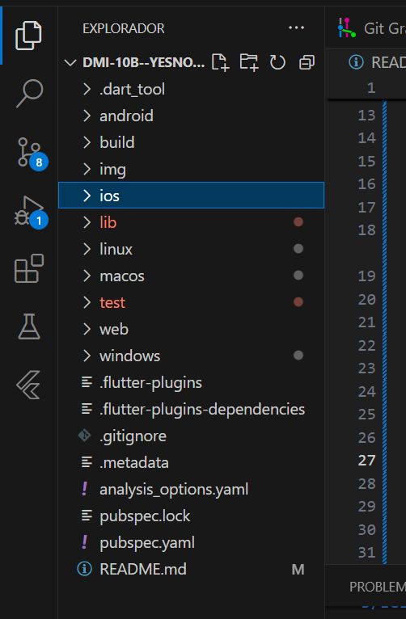

---

<h3> Practica 21 </h3>

| Captura | Descripción | 
|:-------------:|:---------------|
| 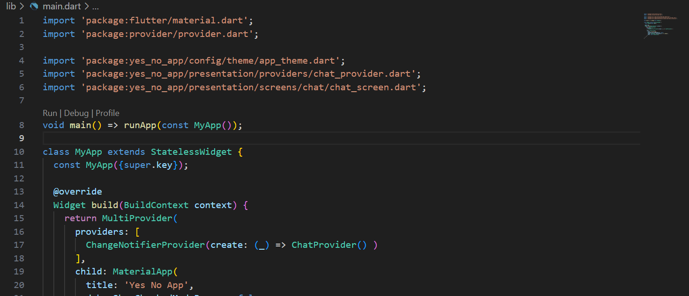 | El archivo main.dart es el punto de entrada de una aplicación.   En este archivo, se inicializa la aplicación utilizando el widget MyApp, el cual configura la gestión del estado mediante Provider, aplica un tema personalizado definido en AppTheme y establece la pantalla principal (ChatScreen).Esta estructura permite gestionar el estado de manera centralizada y asegura que la interfaz de usuario esté basada en el diseño de Material Design, proporcionando una experiencia consistente y eficiente para el usuario. |
| 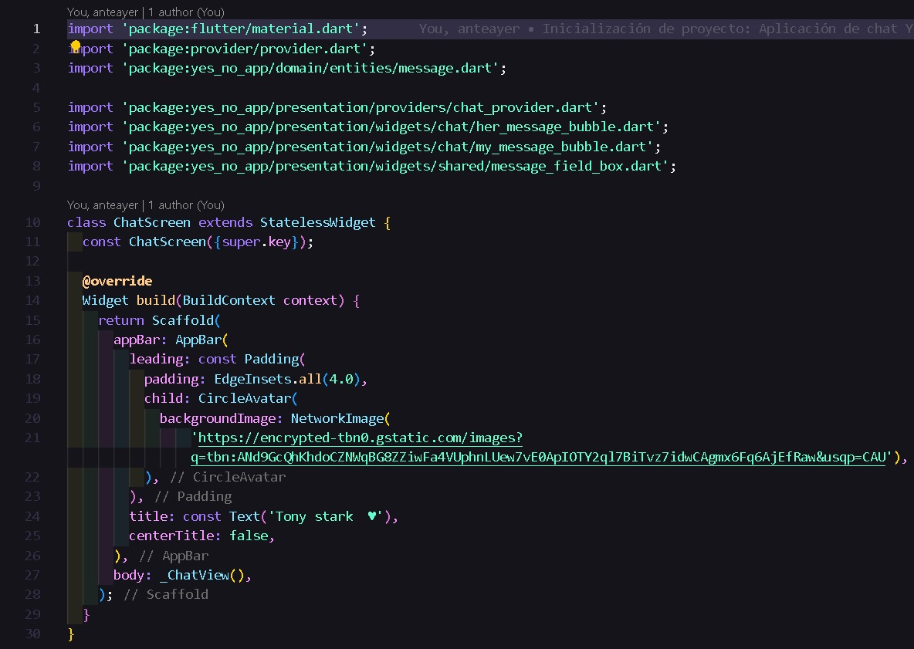 |Define una clase AppTheme que permite crear un tema personalizado para una aplicación Flutter. Lo que permite crear un tema dinámico para la aplicación basado en un conjunto de colores predefinidos, donde el color seleccionado se ajusta mediante el índice proporcionado. La aplicación utilizará Material Design 3 con un esquema de colores determinado por el color seleccionado.|
| 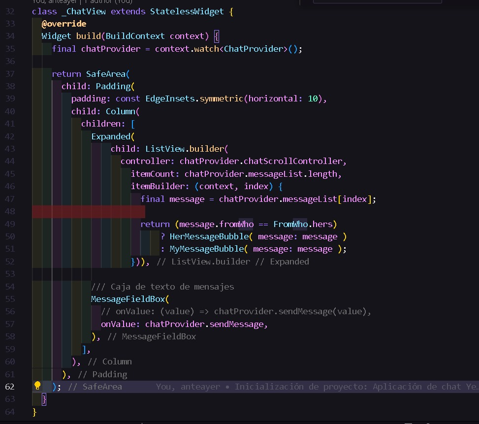 |El widget ChatScreen es la pantalla donde se muestra un chat. Tiene una barra de aplicaciones (AppBar) con un avatar de usuario y un título, y el cuerpo de la pantalla está destinado a mostrar la vista del chat (con _ChatView como widget encargado de ello). Esta estructura proporciona una interfaz básica para la pantalla de chat.

---

<h3> Practica 22 </h3>

| Captura | Descripción | 
|:-------------:|:---------------|
|  |El widget _ChatView es la vista del chat en la aplicación. Muestra una lista de mensajes en un ListView.builder que se desplaza y actualiza en función del estado gestionado por ChatProvider. Los mensajes se presentan con burbujas diferentes según quién los envíe (el usuario o la otra persona). Al final de la pantalla, hay una caja de texto donde el usuario puede escribir y enviar nuevos mensajes.|
| 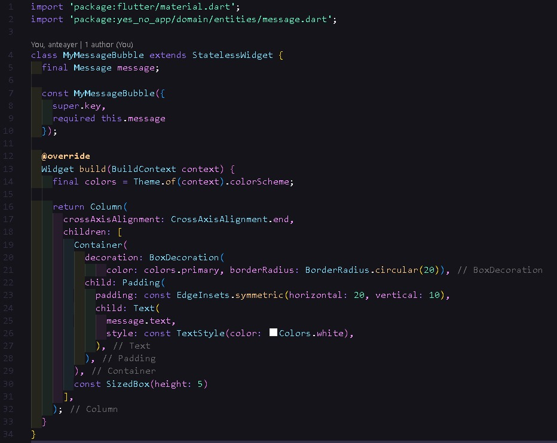 |MyMessageBubble es un widget que muestra el mensaje enviado por el usuario en una burbuja estilizada. El fondo de la burbuja tiene el color primario del tema, y el texto se presenta en blanco. Este widget se utiliza para la visualización de los mensajes del usuario en la interfaz de chat.|
| 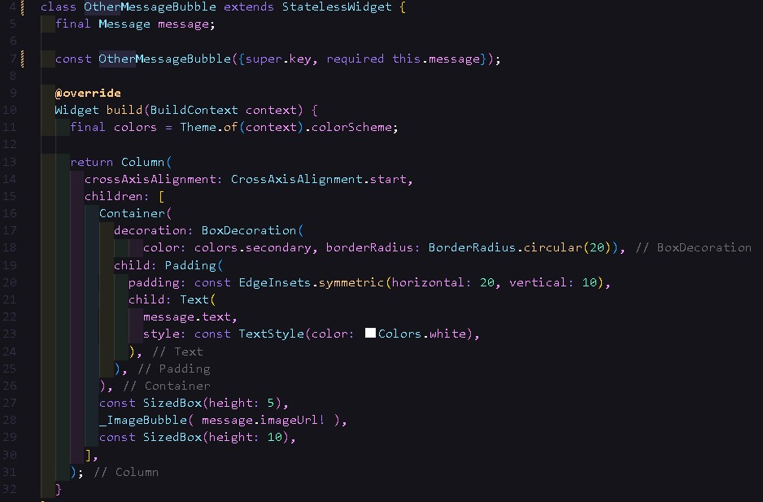 |OtherMessageBubble es un widget que muestra los mensajes que provienen de otra persona en la conversación. Utiliza un Container con fondo de color secundario y texto dentro de un Padding para estilizar los mensajes. |
| 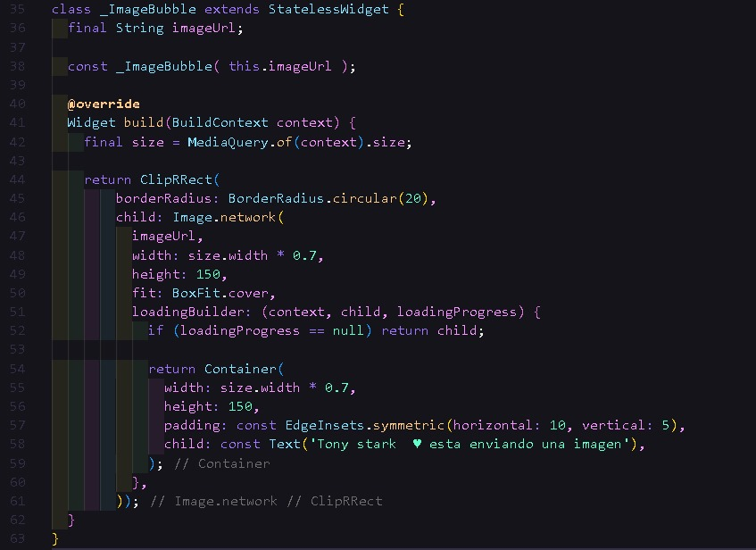 |_ImageBubble es un widget diseñado para mostrar una imagen dentro de una burbuja de mensaje. Maneja el proceso de carga de la imagen y muestra un mensaje indicativo de que la imagen se está descargando. Además, la imagen tiene bordes redondeados y se ajusta al tamaño de la pantalla de forma responsiva, asegurando que se vea correctamente en diferentes dispositivos.|  |El widget MessageFieldBox crea un campo de texto estilizado con un borde redondeado y un botón de envío. Permite al usuario escribir mensajes, y al presionar el icono de envío o la tecla Enter, se llama a una función onValue con el texto ingresado. Además, incluye un manejo del foco y de la interacción con el teclado.|

--- 
<h3> Practica 23 </h3>

| Captura | Descripción | 
|:-------------:|:---------------|
| 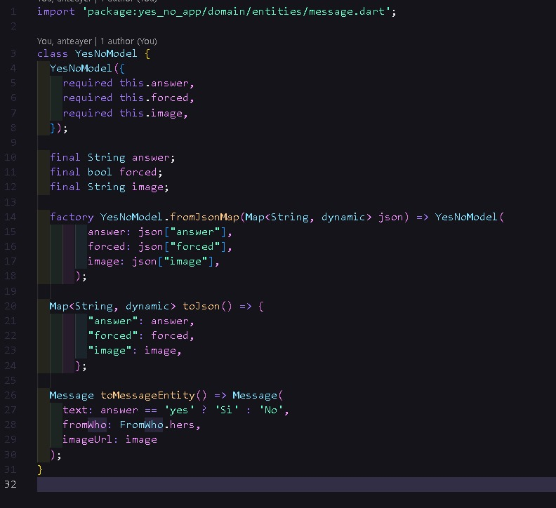 |El código define la clase YesNoModel, que se utiliza como modelo de datos para manejar respuestas del tipo "sí o no" provenientes de una fuente externa . Incluye métodos para convertir instancias desde y hacia formatos JSON, y para transformarlas en una entidad del dominio llamada Message.|
| 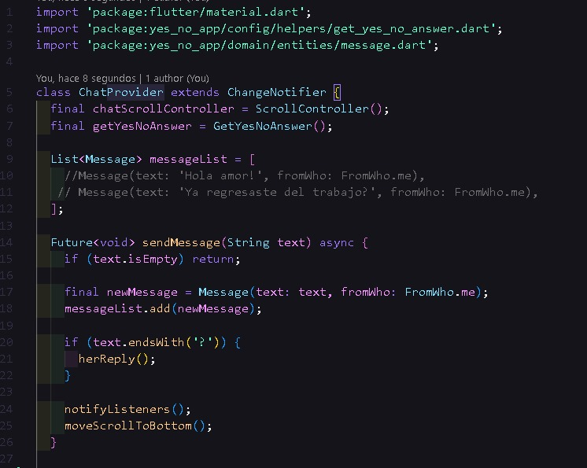 |La clase ChatProvider es el núcleo del manejo del estado del chat. Coordina las acciones entre el envío de mensajes, la recepción de respuestas automáticas, y la actualización visual de la interfaz.|
| 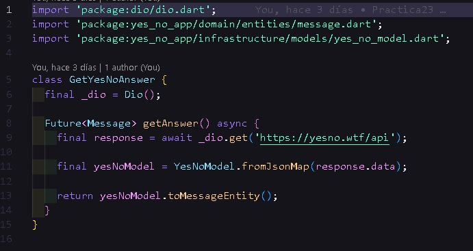 |La clase GetYesNoAnswer actúa como un puente entre la API de yesno.wtf y la lógica de la aplicación. Realiza solicitudes HTTP, transforma las respuestas en objetos internos, y permite integrar respuestas automáticas en el flujo del chat, completando la experiencia interactiva de la aplicación.| 
---
## Resultados

  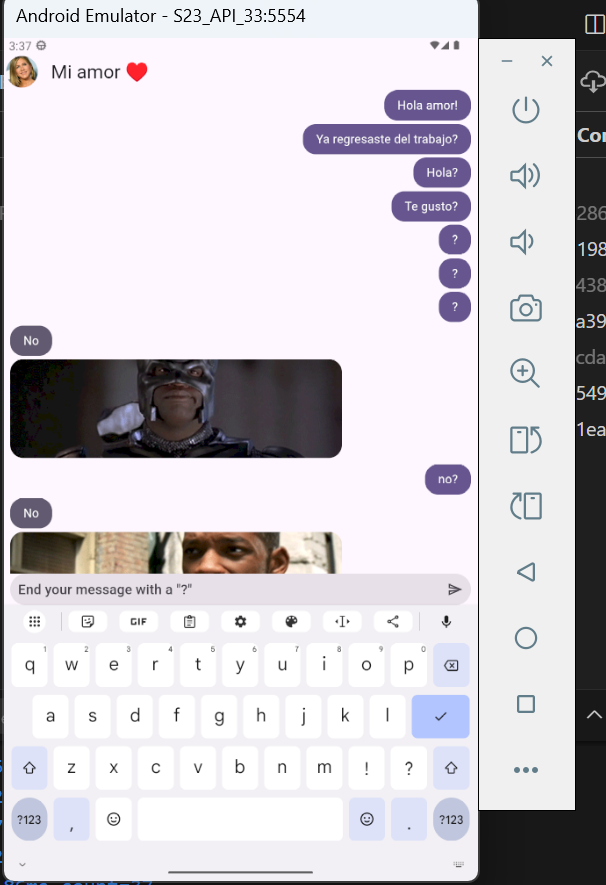

  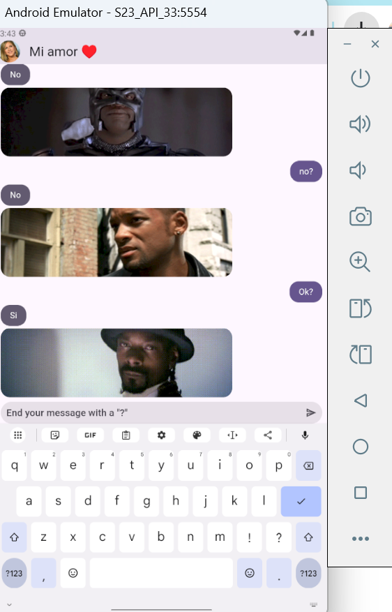

--- 
# HISTORIAL DE PRÁCTICAS:

|No. |Nombre |Potenciador |Estatus |
|--|--|--|--|
|21|Implementación del Encabezado de la App|6|✅Finalizada|
|22|Implementación de la UI para la Aplicación de Yes/No|7|✅Finalizada
|23|Implementación de la Funcionalidad de la Aplicación de Yes/No|10|✅Finalizada|
## Linck de PADLET
https://bit.ly/practicas-10B-dmi

## LISTA DE HERRAMIENTAS

## Autor
Elaborado por :T.S.U José Zahid Ramirez Estudillo [@NoviodeAme]()